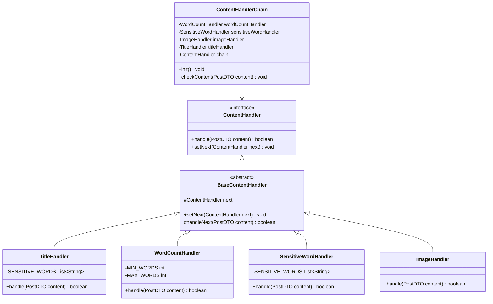

# ABlog - 现代化的博客平台

## 项目仓库
- gitee
	- [ablog-front: 一个 简单 博客系统 前端 (gitee.com)](https://gitee.com/Agiantii/ablog-front)
	- [ablog-backend: 简单的博客系统 (gitee.com)](https://gitee.com/Agiantii/ablog-backend)
## 运行环境
windows , linux, mac
## 网址
[agiantii.fun](http://agiantii.fun
) 2024.12.31 到期
## 项目介绍

  

ABlog 是一个面向开发者和技术爱好者的现代化博客平台。它专注于提供优质的技术内容创作和分享体验，支持 Markdown 编写，并集成了代码高亮、数学公式、流程图等专业特性。

> ps
> - 前端 利用 cursor 生成
> - 后端结合 设计模式 写了一写 crud
> - 答辩时的 博客广场 是乱取的


### 主要特点

  
- **内容审核** 文章 内容 、 外链、 篇幅等的 审核
- **文章批量上传** 
- **支持自定义图床**
- **方便代码片段的分享**
- **优雅的写作体验**：集成专业的 Markdown 编辑器，支持实时预览
- **代码展示**：支持多种编程语言的语法高亮，适合技术内容创作
- **数学公式**：内置 KaTeX 支持，完美展示数学公式
- **图表支持**：集成 Mermaid，轻松创建流程图、时序图等
- **深色模式**：自适应系统主题，提供舒适的阅读体验


  

### 目标用户

  

- 爱写博客的人

  

### 技术栈

#### front 
- Vue 3 + Vite + Element Plus

- 状态管理：Pinia

- Markdown：md-editor-v3
#### backend
- springboot
- mybatis-plus

### 亮点功能

  

- 文章批量导入

- 智能排版和美化

- 社交互动（关注）


##  UML

  

###  策略模式


#### 优点

- **算法切换自由**：可以在运行时根据需要切换算法。

-  **避免多重条件判断**：消除了复杂的条件语句。

-  **扩展性好**：新增算法只需新增一个策略类，无需修改现有代码。

#### 缺点

使用起来找不到

### 责任链模式

  



  
  

#### 优点

-  **降低耦合度**：发送者和接收者之间解耦。

-  **简化对象**：对象不需要知道链的结构。

-  **灵活性**：通过改变链的成员或顺序，动态地新增或删除责任。

-  **易于扩展**：增加新的请求处理类很方便。

#### 缺点

写起来不太习惯

```java

st.setNext(a);

b.setNext(c);

c.setNext(ed);

st.handle(content);

// 这样写起来稍微 有点不习惯

// 不妨试试  直接利用 迭代器 来 处理所有的 handler

```

### 迭代器


#### 优点

-  **支持多种遍历方式**：不同的迭代器可以定义不同的遍历方式。

-  **封装** 不过多暴露内部结构

### 工厂模式

  

我们发现 这些拦截器 也可以利用 工厂方法 生产,进而 可以更方便后续使用

但是 springboot 的依赖注入 相当于 实现了 一个 大工厂 ，所以 这些产品 都 通过 依赖注入 实现

###  观察者模式

  

粉丝 相当于 是 观察者

作者 相当于 被观察者

被观察的状态更新 就会触发 一个事件，粉丝做出相应的反应

这里的 lis 在这里 是存储在数据库中，而 add，remove 等也是对数据库的操作，这里主要体现 观察者模式的思想 
```java

class Author implements Subject{

    List<Observer> lis ;

  

    Integer data;

    Author(){

        lis = new ArrayList<>();

    }

    void add(Observer o)

    void remove(Observer o)

    void uploadArticle(Integer date){

        notify()

    }

    void notify(){

        for(Observer fan:list){

            fan.sentEmail();

        }

    }

}

  

class Fans implements Observer{

    String email;

    Fans(String email){

        this.email = email;

    }

    void sentEmail(){

        System.out.print("send email to" + email);

    }

}

```

## Project Setup 

### front

```sh

npm install

```

  

####  Compile and Hot-Reload for Development

  

```sh

npm run dev

```

  

####  Compile and Minify for Production

  

```sh

npm run build
```


## backend

- 配置数据库 
- 修改application.yml 配置
- 运行