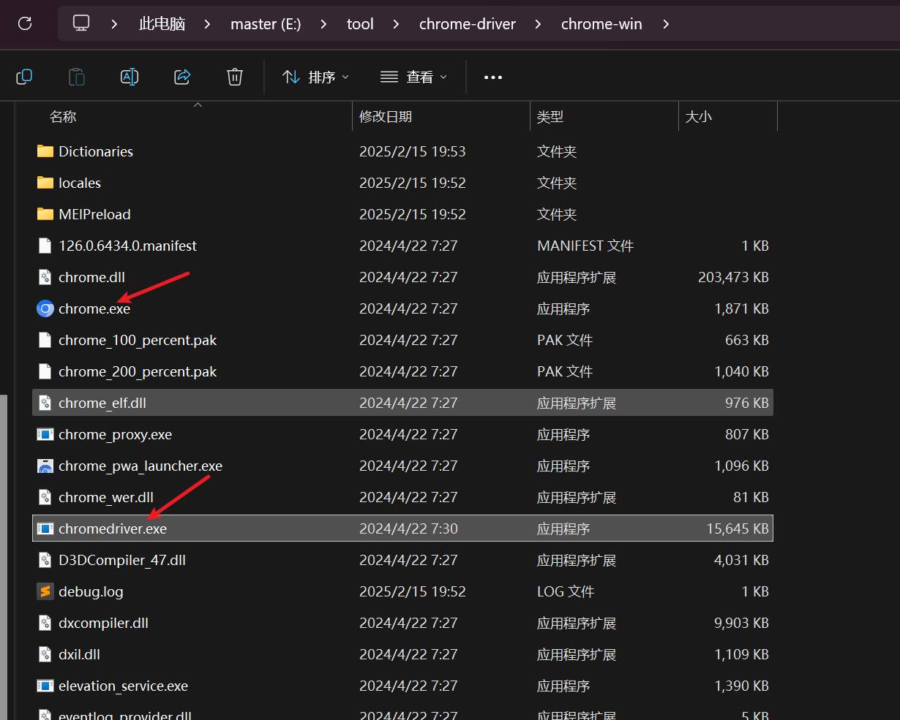

## 记录一下 python selenium 的使用，以及一些常见问题的解决方法。


### python 安装 selenium
```shell
pip install selenium
```
### 安装浏览器驱动

可以到[这里](https://commondatastorage.googleapis.com/chromium-browser-snapshots/index.html?prefix=Win/1290606/) 下载对应的 chrome 以及 driver,一起下来

然后driver 跟 chrome 目录放到一起，程序可以指定 driver 的路径，也可以放到环境变量中

如图

### 代码示例


```python
# 最简单的 selium 使用

from selenium import webdriver

driver_path = r"E:\tool\chrome-driver\chrome-win\chromedriver.exe"
service = webdriver.chrome.service.Service(driver_path)
driver = webdriver.Chrome(service=service)
driver.get("https://www.baidu.com")
print(driver.title)
driver.quit()

```